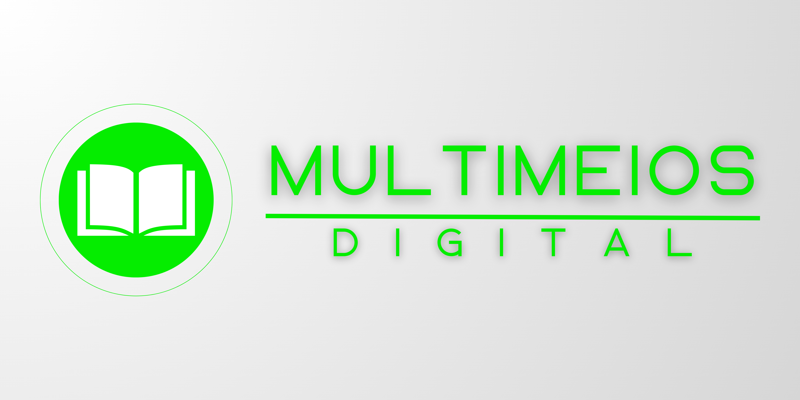

  

## 🖥️ Sobre o Projeto
A Multimeios Digital é uma aplicação web para auxliar na gestão de livros de uma biblioteca escolar, o projeto foi desenvolvido durante prova de conclusão de curso técnico de tecnologia da informação.

 <a href="#-sobre-o-projeto">Sobre</a> •
 <a href="#-funcionalidades">Funcionalidades</a> • 
 <a href="#tecnologias">Tecnologias</a> • 
 <a href="#contribuicao">Contribuição</a> • 
 <a href="#licenc-a">Licença</a> • 
 <a href="#autor">Autor</a>

##	🚧  Mutimeios Digital 🚀 Em construção...  🚧

## 🛠️ Funcionalidades

- [x] Cadastro e login de cliente
- [x] Edição e exclusão de informações do cliente
- [x] Cadastro e login de administradores
- [x] Registro, exclusão e edição de livros
- [x] Histórico de alocagens
- [x] Alocagens de livros
- [ ] Limitar multiplas alocagens

## 🚀 Tecnologias

As seguintes ferramentas foram usadas na construção do projeto:

- [Html](https://developer.mozilla.org/pt-BR/docs/Web/HTML)
- [Css](https://developer.mozilla.org/pt-BR/docs/Web/CSS)
- [PHP](https://www.php.net/)
- [JavaScript](https://developer.mozilla.org/pt-BR/docs/Web/JavaScript)
- [Bootstrap](https://getbootstrap.com/)
- [jQuery](https://jquery.com/)
